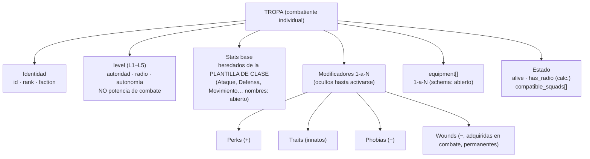
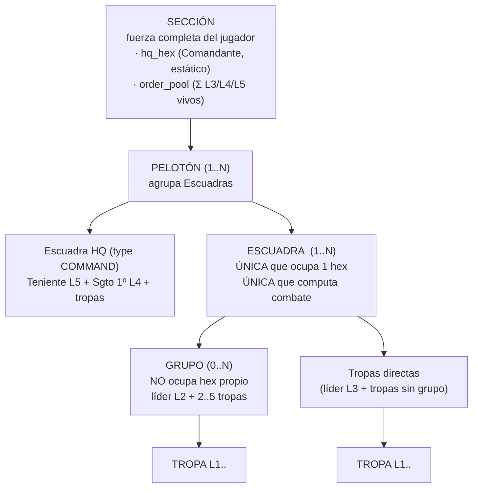
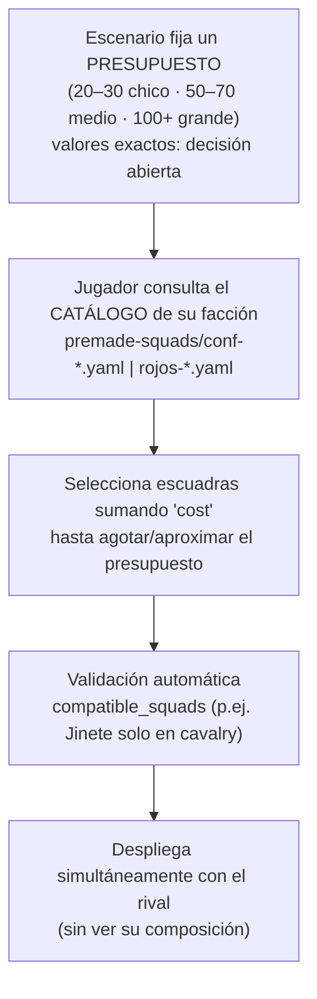
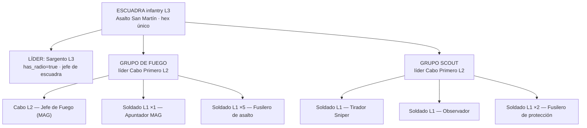
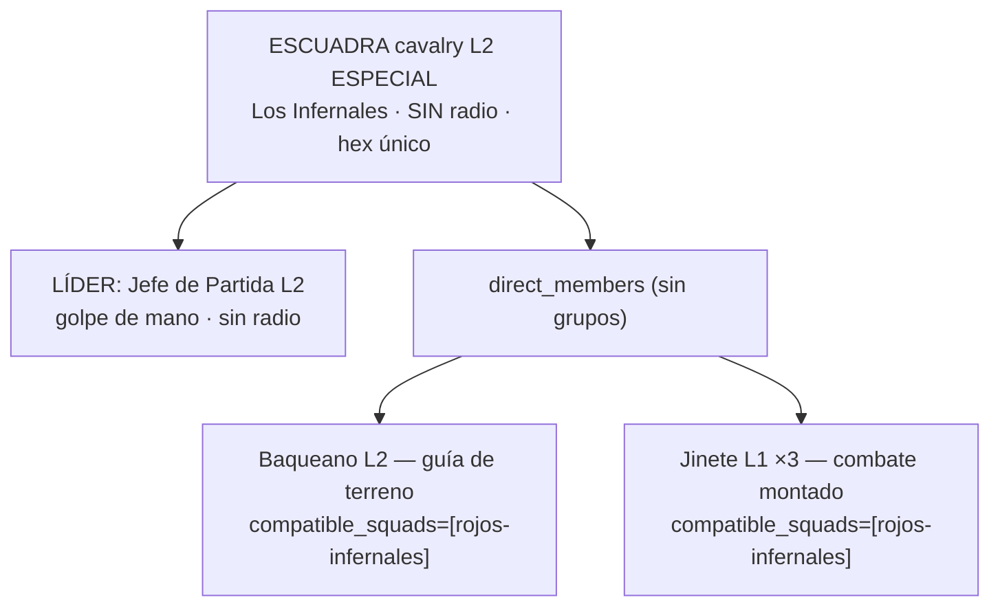
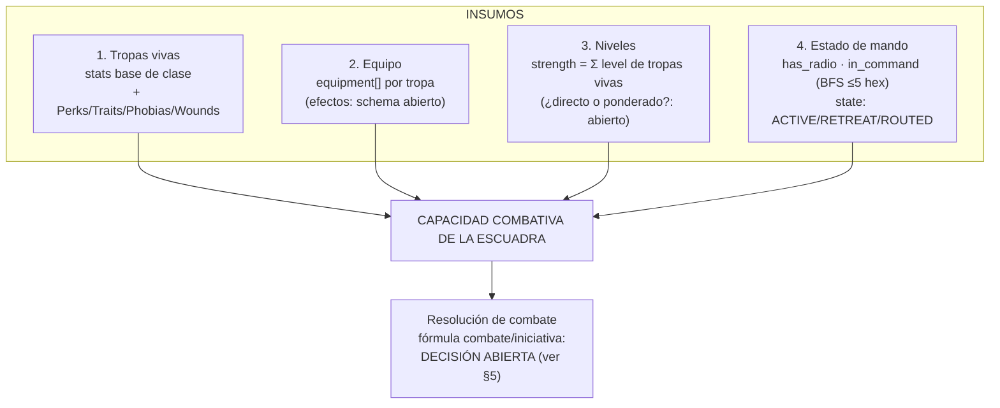

# Estructura del Ejército y Fuerza de Combate

> Documento pedagógico. Reconcilia el modelo de datos de ADR-009 con el manual y los
> YAML de `docs/premade-squads/`. No introduce reglas nuevas: donde algo no está
> decidido, se marca como **decisión abierta**. Terminología canónica según ADR-001.

Índice visual:

1. [Qué es una unidad — la Tropa y su ficha](#1-qué-es-una-unidad--la-tropa)
2. [Jerarquía de agregación — de la Tropa a la Sección](#2-jerarquía-de-agregación)
3. [Cómo se conforma un ejército — presupuesto y despiece de escuadras reales](#3-cómo-se-conforma-un-ejército)
4. [Fuerza de combate de una unidad](#4-fuerza-de-combate-de-una-unidad)
5. [Decisiones abiertas](#5-decisiones-abiertas-relevantes)

---

## 1. Qué es una unidad — la Tropa

La **Tropa** es la unidad atómica: un combatiente individual. Todo lo demás
(Grupo, Escuadra, Pelotón, Sección) es agregación de Tropas.

### 1.1 Anatomía de una Tropa



**Idea clave (manual/04):** todos los soldados de la misma clase arrancan con
**stats base idénticos**. Divergen por los **modificadores** asignados — y esos
modificadores se asignan **aleatoriamente en el servidor** y son **invisibles
para el jugador** hasta que se manifiestan en juego (niebla de guerra interna).

Las **Wounds** son un modificador especial: no se asignan al inicio, se acumulan
por daño y son permanentes durante la partida. El soldado es eliminado cuando la
suma de penalizadores de heridas cruza un umbral (**umbral: decisión abierta**).

### 1.2 Ficha de Tropa (ejemplo ilustrativo)

Construida con datos reales de `conf-infanteria-estandar.yaml` (el "Apuntador MAG").
Stats y modificadores son **placeholders** — sus catálogos están abiertos.

```
┌─────────────────────────────────────────────────────────────┐
│  FICHA DE TROPA                                              │
├─────────────────────────────────────────────────────────────┤
│  rank ........... Soldado                                    │
│  level .......... L1   (sin radio · sin autonomía)           │
│  faction ........ confederacion                              │
│  función ........ Apuntador MAG                              │
│  squad_ref ...... conf-infanteria-estandar / Grupo de Fuego  │
│  compatible_sq .. [infantry, mortars, recon, engineers, …]   │
├─ STATS BASE (plantilla de clase "Soldado") ─────────────────┤
│  Ataque ......... <abierto>   Defensa ..... <abierto>        │
│  Movimiento ..... <abierto>   …             <abierto>        │
├─ MODIFICADORES (OCULTOS hasta activarse en juego) ──────────┤
│  Perks .......... ? ? ?     ← el jugador NO los ve al inicio │
│  Traits ......... ? ? ?                                      │
│  Phobias ........ ? ? ?                                      │
│  Wounds ......... (ninguna al inicio; se acumulan en combate)│
├─ EQUIPO ────────────────────────────────────────────────────┤
│  equipment[] .... [MAG, munición, …]  (schema: abierto)      │
├─ CALCULADO ─────────────────────────────────────────────────┤
│  has_radio ...... false   (level < 3)                        │
│  alive .......... true                                       │
└─────────────────────────────────────────────────────────────┘
```

> Excepción de radio: la **Tropa de Comunicaciones** es L1 pero porta radio
> global; no manda ni extiende la cadena por sí sola — solo **amplifica** el
> radio de su oficial L3+ (alcance de amplificación: **decisión abierta**).

---

## 2. Jerarquía de agregación

Cinco entidades anidadas (ADR-009). Las tres que el jugador gestiona en partida
son **Tropa**, **Grupo** y **Escuadra**; **Pelotón** y **Sección** son el armazón.



### 2.1 Tamaños típicos y nivel de mando por capa

| Entidad | Ocupa hex | Computa combate | Tamaño típico | Líder / nivel |
|---|---|---|---|---|
| **Sección** | No (HQ fijo) | No | 1..N pelotones | Comandante (HQ estratégico) |
| **Pelotón** | No | No | HQ + varias escuadras | Teniente **L5** + Sgto 1º **L4** |
| **Escuadra estándar** | **Sí (1 hex)** | **Sí** | 4 a ~15 tropas | Sargento **L3** (con radio) |
| **Escuadra especial** | **Sí (1 hex)** | **Sí** | ~5 a 7 tropas | Cabo/Jefe de Partida **L2** (sin radio) |
| **Grupo** | No (parte de su escuadra) | No | 2..5 + líder | **L2** |
| **Tropa** | No (parte de su escuadra) | No | 1 | L1..L5 |

### 2.2 Niveles L1–L5: autoridad, radio, autonomía

`level` define **autoridad/radio/autonomía**, **nunca** poder de combate
(un L1 puede pegar tan fuerte como un L5).

```
L5  Teniente ........ mando de Pelotón   · radio 5 hex · autonomía alta
L4  Sargento 1º ..... subjefe Pelotón     · radio 5 hex · autonomía alta
L3  Sargento ........ jefe de Escuadra    · radio 5 hex · autonomía media
L2  Cabo/J.Partida .. líder Grupo  O  líder Escuadra especial · SIN radio · limitada
L1  Soldado ......... tropa básica        · SIN radio · sin autonomía (se desbanda sin mando)
        └─ excepción: Tropa de Comunicaciones L1 → radio global (solo amplifica a su L3+)
```

El **L2 tiene doble uso**: dentro de una escuadra estándar es sub-líder de un
**Grupo** (depende del L3); como líder de una **escuadra especial** manda toda
la escuadra con órdenes genéricas y reglas propias.

### 2.3 Cadena de mando y regla del radio de 5 hex

Una escuadra está **en mando** si está a ≤ 5 hex (Manhattan) del HQ de Pelotón
**o** de otra escuadra ya en mando: es un *flood-fill* hop a hop. Cada escuadra
intermedia es **relay involuntario**.

```mermaid
graph LR
    HQ["HQ Pelotón"] -->|"≤5 hex"| A["Escuadra A<br/>EN MANDO"]
    A -->|"≤5 hex (relay)"| B["Escuadra B<br/>EN MANDO vía A"]
    A -. ">5 hex .-> C["Escuadra C<br/>FUERA DE MANDO"]
```

`has_radio` de la escuadra = `true` si alguna tropa portadora viva. Regla dura
(manual/08): **si muere el L3 líder, la escuadra pierde la radio aunque queden
L4/L5** — el valor está en el entrenamiento del líder, no en el aparato.
Sin radio: no es relay y no recibe órdenes nuevas del HQ el resto de la partida.

---

## 3. Cómo se conforma un ejército

### 3.1 Proceso de armado (presupuesto de puntos)



Cada YAML trae su `cost`. El jugador combina escuadras como una lista de la
compra contra el presupuesto. Las restricciones `compatible_squads` impiden
mezclas inválidas (un Jinete no entra en morteros). **Personalización**
(editar premades, escuadras custom): **decisión abierta** (03b).

Ejemplo de armado (manual/03b), presupuesto 60 "pts de escenario": Infantería A
+ Infantería B + Morteros + Reconocimiento. *(Nota: los `cost` de los YAML están
en otra escala — p.ej. 200 — y la conversión a "puntos de escenario" es
**decisión abierta**.)*

### 3.2 Despiece A — Confederación: `conf-infanteria-estandar`

`Escuadra de Asalto San Martín` · type **infantry** · **L3** · cost **200** · 14 tropas.



Recuento: Sargento L3 (1) + Grupo de Fuego [Cabo Primero L2 + Cabo L2 + 1 + 5 = 8]
+ Grupo Scout [Cabo Primero L2 + 1 + 1 + 2 = 4] + Comunicaciones L1 (manual/04b
lista una Tropa de Comunicaciones; en el YAML actual no figura — **discrepancia
documentada, no la resuelvo**). Estructura: **2 grupos internos bajo dos L2**,
sin `direct_members`. El Sargento L3 es el único con radio.

### 3.3 Despiece B — Los Rojos: `rojos-infernales`

`Los Infernales` · type **cavalry** · **L2 especial** (`special_rules=true`) ·
cost **150** · 4 tropas. Escuadra **sin radio**, órdenes genéricas, reglas de
caballería propias.



Solo Infernales/Baqueano/Jinete pueden integrarla (`compatible_squads`
restringido). No es relay, no extiende mando. Su disband no viene de perder
radio (nunca tuvo) sino de perder al **Jefe de Partida L2** o de que la orden
genérica deje de ser ejecutable.

### 3.4 Despiece C — Los Rojos: `rojos-infanteria-estandar` (contraste estándar)

`Asalto Camilo Cienfuegos` · infantry · **L3** · cost **195** · simétrica a la
de Confederación pero con nomenclatura roja: líder **Sargento de Segunda L3**
(radio), Grupo de Fuego (líder *Sargento de Tercera* L2) y Grupo de Exploración
(líder *Sargento de Tercera* L2). Confirma el principio de ADR-001/03: las
facciones son **mecánicamente simétricas**; cambian nombres y catálogo, no reglas.

### 3.5 La capa Pelotón/Sección con un premade real

`conf-hq-peloton.yaml` es el elemento de mando que ADR-009 modela como
**Escuadra de tipo COMMAND** dentro del Pelotón:

```
SECCIÓN (Confederación)
└── PELOTÓN "Saavedra"
    ├── HQ (COMMAND, L5)  ← conf-hq-peloton.yaml
    │     Teniente L5 (radio) · Sargento 1º L4 (radio)
    │     Comunicaciones L1 (radio global) · Soldado ×3 (ordenanzas)
    ├── conf-infanteria-estandar  (infantry L3)
    ├── rojos-infernales / etc.   (según facción/catálogo)
    └── …
```

`order_pool` de la Sección = suma de contribuciones de los L3/L4/L5 vivos
(fórmula exacta de la contribución: **decisión abierta**).

---

## 4. Fuerza de combate de una unidad

La "fuerza de combate" de una **Escuadra** (única entidad que computa combate)
emerge de cuatro insumos. La agregación numérica final está parcialmente abierta.



### 4.1 Cómo influye cada insumo

| Insumo | Qué aporta | Estado de definición |
|---|---|---|
| Tropas vivas + stats base | potencia individual por clase | nombres de stats: **abierto** |
| Modificadores | divergencia por soldado; Wounds degradan permanentemente | catálogos y umbral de eliminación: **abierto** |
| Equipo | bonos/capacidades (MAG, mortero, radio) | schema Equipment: **abierto** |
| `strength` | masa de la escuadra; cada baja la reduce | `Σ tropa.level` vivos; ¿ponderado?: **abierto** |
| `moral` | dispara estados ACTIVE/RETREAT/ROUTED (vía Valor) | agregación de moral: **abierto** |
| Mando (`has_radio`, `in_command`) | si la escuadra recibe órdenes / actúa de relay | regla determinada (manual/08) |

### 4.2 Por qué importan los niveles altos

`strength = Σ level` de tropas vivas ⇒ perder al **L3** o a un **L2** resta más
que perder un L1, y además rompe radio/organización interna. La degradación es
doble: **menos masa** + **menos mando**.

```
Escuadra 14 tropas, ACTIVE ──baja de 5 L1──> 9 tropas: funcional, menor strength
Escuadra ──muere L3──────────────────────> has_radio=false, aislada, mismo strength-3
Escuadra ──Valor < umbral──> RETREAT ──< umbral──> ROUTED (incontrolable, reversible)
```

Los estados de escuadra (Valor) son **distintos** de las Wounds individuales:
una escuadra ACTIVE puede tener soldados heridos cuya degradación es permanente
(un Sanitario solo **estabiliza**, no cura).

---

## 5. Decisiones abiertas relevantes

| # | Tema | Dónde se decide |
|---|---|---|
| 1 | Fórmula exacta de `strength` (¿`level` directo o ponderado?) | ADR-009 / pendiente |
| 2 | Agregación de `moral` y umbrales de estado por Valor | manual/09 (Valor) |
| 3 | Fórmula de combate e iniciativa de la escuadra | **ver ADR-011 / ADR-012** (en redacción por otros agentes) |
| 4 | Nombres de stats base; catálogos de Perks/Traits/Phobias | manual/04 / pendiente |
| 5 | Umbral de eliminación por acumulación de Wounds | manual/04 / manual/07 |
| 6 | Schema completo de `Equipment` y efectos en combate | pendiente |
| 7 | Valores de presupuesto por dificultad y conversión a los `cost` de los YAML | manual/03b / pendiente |
| 8 | Personalización de premades / escuadras custom | manual/03b / pendiente |
| 9 | Alcance exacto de amplificación de la Tropa de Comunicaciones | manual/08 / pendiente |
| 10 | Discrepancia: Comunicaciones L1 en manual/04b vs. ausente en `conf-infanteria-estandar.yaml` | reconciliación pendiente (no resuelta aquí) |
| 11 | Reglas especiales de CAVALRY / ENGINEERS / Grupo Scout | manual/04b / pendiente |
| 12 | Reasignación de órdenes genéricas a escuadras L2 en partida | manual/04b / pendiente |

> Este documento no inventa números para los puntos abiertos. Cualquier fórmula
> de combate/iniciativa debe consumirse de ADR-011/ADR-012 cuando estén aceptados.
